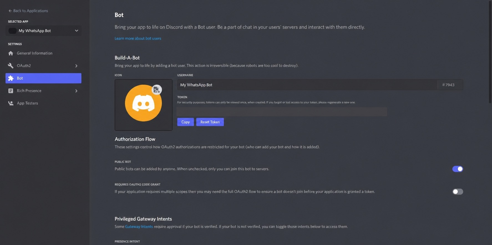

# Setup

WA2DC needs a Discord application, a private Discord server area, and one supported runtime. The written instructions below follow the current interfaces. The preserved screenshots at the end show the 2022 interface and are illustrative only.

## 1. Create the Discord application

1. Open the [Discord Developer Portal](https://discord.com/developers/applications/) and select **New Application**.
2. Give the application a name and create it. New Discord applications already include a bot user; the old **Add Bot** step is no longer required.
3. Open the application's **Bot** page.
4. Under **Token**, select **Reset Token** if necessary, then copy the token. Store it like a password and never paste it into an issue, screenshot, or chat.
5. Under **Privileged Gateway Intents**, enable **Message Content Intent**. WA2DC needs message content, embeds, attachments, and polls to bridge Discord messages.

Discord's [application quick start](https://docs.discord.com/developers/quick-start/getting-started) and [Gateway intent reference](https://docs.discord.com/developers/events/gateway) describe the current portal flow.

## 2. Choose how to run WA2DC

Create a dedicated WA2DC directory so the database, logs, and runtime files stay together.

### Packaged binary

1. Download the executable for your operating system and CPU from [GitHub Releases](https://github.com/arespawn/WhatsAppToDiscord/releases/latest).
2. Move it into the dedicated directory.
3. On Linux or macOS, make it executable and run it from a terminal:

   ```bash
   chmod +x ./WA2DC-Linux
   ./WA2DC-Linux
   ```

   Substitute the downloaded filename as needed.
4. Packaged releases can bootstrap the matching signed `runtime/` media sidecar automatically. If you install the sidecar manually, extract the release's matching runtime archive beside the executable as `runtime/`.

Windows SmartScreen or antivirus tools may warn about an unfamiliar unsigned publisher. Verify that the file came from the project's release page and compare the published checksum before running it. See [Troubleshooting & FAQ](faq.md#why-is-the-binary-flagged-as-unknown-or-suspicious).

### Docker Compose

1. Clone or download the repository.
2. Copy `.env.example` to `.env` and set the Discord token:

   ```dotenv
   WA2DC_TOKEN=your-discord-bot-token
   ```

3. Start the service:

   ```bash
   docker compose up -d
   ```

The compose file mounts `./storage` for persistence and restarts the container unless it is stopped. Update Docker deployments with:

```bash
docker compose pull wa2dc
docker compose up -d wa2dc
```

### Node.js source

Node.js 24 or newer is required.

```bash
git clone https://github.com/arespawn/WhatsAppToDiscord.git
cd WhatsAppToDiscord
npm ci
npm start
```

`npm start` uses the watchdog runner. Running `node src/index.js` directly skips watchdog restarts and packaged rollback handling. The [installer scripts](install-scripts.md) can automate the source installation on supported platforms.

## 3. Start WA2DC and invite the bot

1. Provide the Discord token through `WA2DC_TOKEN` in `.env`, or paste it into the first-run terminal prompt.
2. WA2DC logs a generated Discord authorization URL containing the required `bot` and `applications.commands` scopes and permissions.
3. Open that URL, choose the target Discord server, and authorize the bot. You need permission to manage that server.
4. WA2DC creates a `whatsapp` category and `#control-room` channel.
5. Restrict access to the control channel and any bridged channels with Discord channel and role permissions. WA2DC deliberately relies on Discord permissions rather than maintaining a separate command-authorization system.

If slash commands do not appear, use the newly generated authorization URL to re-invite the bot with both required scopes.

## 4. Pair WhatsApp

WA2DC posts a WhatsApp QR code in `#control-room`. On your phone, open WhatsApp's linked-device screen and scan it. WhatsApp's [linked-device help](https://faq.whatsapp.com/539218963354346/) explains the phone-side steps.

If QR pairing is unavailable, run `/pairwithcode phone:<E.164 phone number>` while a fresh pairing prompt is active. Pairing codes may trigger a browser-profile restart and are less reliable than QR scanning; see [WhatsApp pairing and sessions](faq.md#whatsapp-pairing-and-sessions).

After pairing, use `/start`, `/link`, or `/defaultchat` to create and manage bridged targets.

## 5. Protect and back up the install

- Stop WA2DC before copying the complete `storage/` directory for backup.
- If `WA2DC_DB_PASSPHRASE` was set when the database was created, preserve that exact passphrase separately; the encrypted data cannot be recovered without it.
- Treat `.env`, `storage/wa2dc.sqlite`, `logs.txt`, `terminal.log`, downloads, and packaged `.oldVersion` files as sensitive.
- Keep the host patched and restrict remote access. WA2DC has access to both the configured Discord server and the paired WhatsApp account.

Continue with [Configuration](configuration.md) and the [Slash Command Reference](commands.md).

## Historical interface examples (2022)

> [!WARNING]
> These screenshots are preserved for historical context. Discord, GitHub Releases, and WA2DC have changed since 2022. Follow the written instructions above when a screenshot disagrees. Any credential-like text has been redacted, and the QR code is expired.

<details>
  <summary>1. Old GitHub release assets</summary>
  <p>The filenames and release version shown are historical; choose a current asset matching your platform.</p>
  
</details>

<details>
  <summary>2. Dedicated WA2DC folder</summary>
  
</details>

<details>
  <summary>3. Discord Developer Portal applications page</summary>
  
</details>

<details>
  <summary>4. New Application button</summary>
  
</details>

<details>
  <summary>5. Application name dialog</summary>
  
</details>

<details>
  <summary>6. Obsolete Add Bot screen</summary>
  <p>Current Discord applications already include a bot user. Do not look for this old Add Bot control.</p>
  
</details>

<details>
  <summary>7. Obsolete Add Bot confirmation</summary>
  <p>This confirmation is also obsolete for newly created applications.</p>
  
</details>

<details>
  <summary>8. Historical Bot token page (credential redacted)</summary>
  
</details>

<details>
  <summary>9. Message Content Intent</summary>
  <p>The layout may have changed, but Message Content Intent is still required.</p>
  
</details>

<details>
  <summary>10. Historical WA2DC console</summary>
  
</details>

<details>
  <summary>11. Historical token prompt</summary>
  
</details>

<details>
  <summary>12. Historical generated authorization URL</summary>
  
</details>

<details>
  <summary>13. Historical Discord authorization screen</summary>
  
</details>

<details>
  <summary>14. Historical control channel and QR code</summary>
  
</details>
